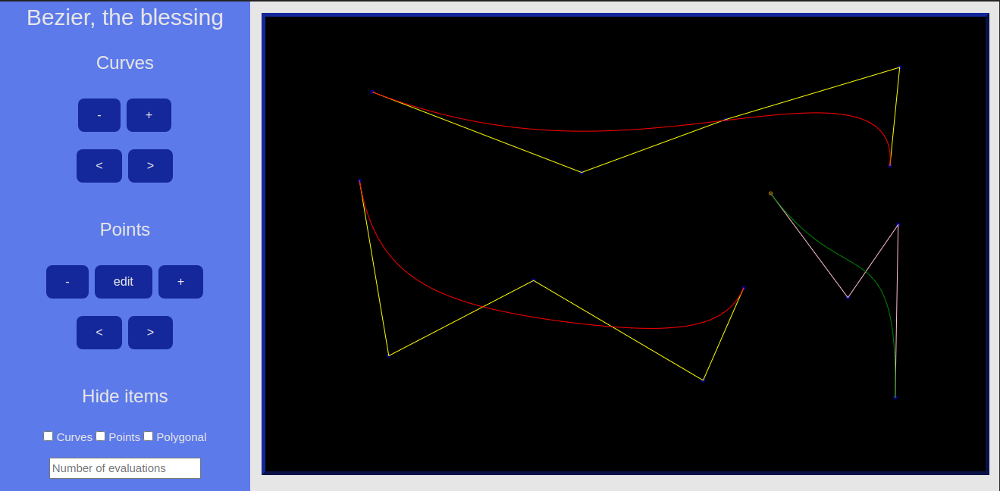

<h3 align="center">
    <b>Projeto da disciplina de Processamento Gráfico</b>  
    <br><br>
    <b>Curvas de Bézier</b>  
    <br>
</h3>

# Índice

- [Sobre](#sobre)
- [Como Usar](#como-usar)
- [Como Contribuir](#como-contribuir)

<a id="sobre"></a>

## :bookmark: Sobre

O <strong>projeto sobre curvas de Bézier</strong> é uma aplicação Web, desenvolvida durante a disciplina de Processamento Gráfico, do Centro de Informática da Universidade Federal de Pernambuco, tendo em vista desenvolver e colocar em prática os conhecimentos adquiridos durante a disciplina.

Curva de Bézier é uma curva polinomial expressa como a interpolação linear entre alguns pontos representativos, chamados de pontos de controle. É uma curva utilizada em diversas aplicações gráficas como o Illustrator, Freehand, Fireworks, GIMP, Photoshop, Processing, Inkscape, Krita e CorelDRAW, e formatos de imagem vetorial como o SVG. Esse tipo de curva também pode originar Superfícies de Bézier, bastante utilizadas em modelagem tridimensional, animações, design de produtos, engenharia, arquitetura entre outras aplicações.

Ela foi desenvolvida em 1962 e seu nome é devido a quem publicou o primeiro trabalho sobre a curva, o francês Pierre Bézier, funcionário da Renault, que a usou para o design de automóveis. Ela foi estruturada a partir do algoritmo de Paul de Casteljau, da Citroën, em 1957, e foi formalizada na década de 60.

<a id="tecnologias-utilizadas"></a>

## :rocket: Tecnologias Utilizadas

O projeto foi desenvolvido utilizando as seguintes tecnologias

- [HTML]
- [CSS]
- [Javascript]

## :heavy_check_mark: :computer: Aplicação

<h1 align="center">
    
</h1>

<a id="como-usar"></a>

## :fire: Como usar

1. Faça um clone :

```sh
  $ git clone https://github.com/gabrielnogueiralt/bezier-curves
```

2. Executando a Aplicação:

```sh
  # Entre na pasta raiz e execute o arquivo index.html
```

<a id="como-contribuir"></a>

## :recycle: Como contribuir

- Faça um Fork desse repositório,
- Crie uma branch com a sua feature: `git checkout -b my-feature`
- Commit suas mudanças: `git commit -m 'feat: My new feature'`
- Push a sua branch: `git push origin my-feature`

---
